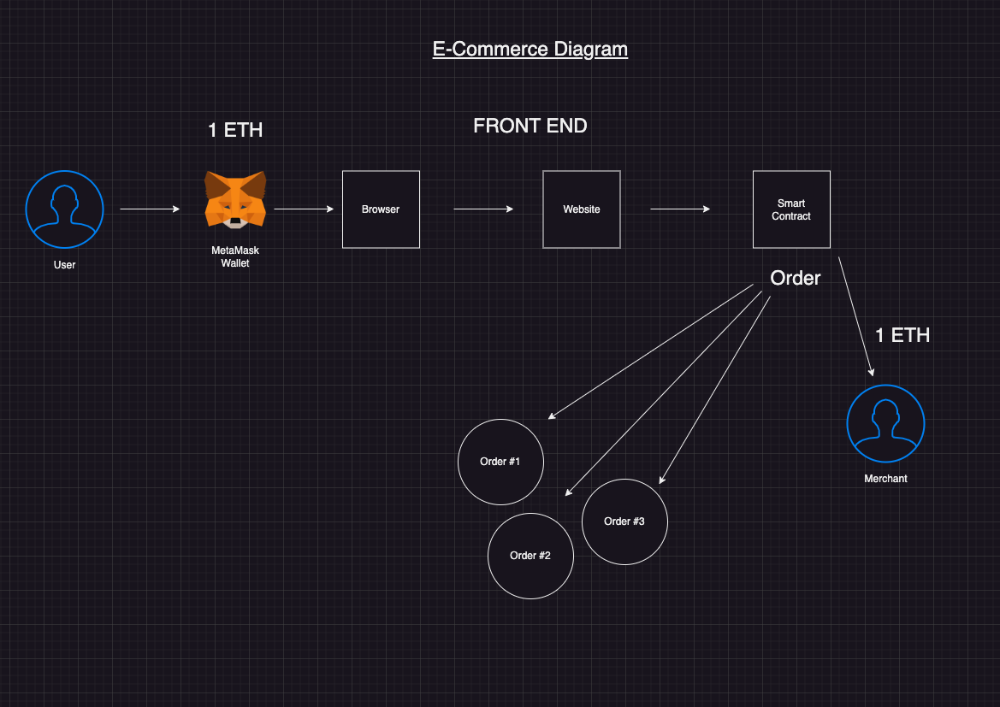
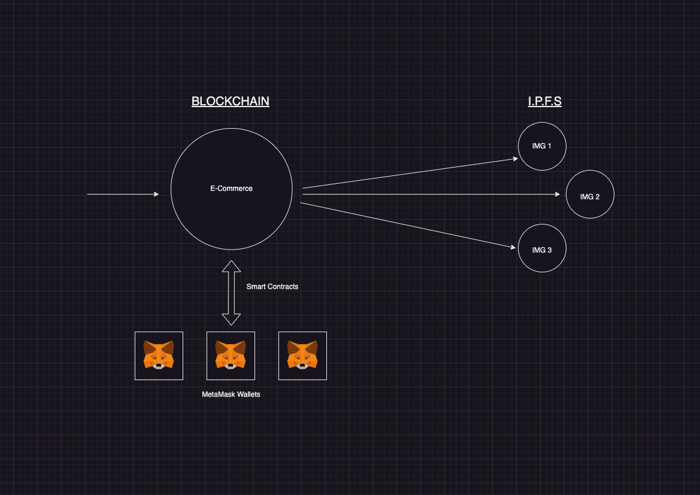

# <u>Blockforme</u>

This is a basic web3 e-commerce project using Solidity

---
### <u>Tech stack and tools</u>

- [Solidity](https://soliditylang.org/) (Smart Contracts and tests)
- [JavaScript](https://developer.mozilla.org/en-US/docs/Web/JavaScript) (React and tests)
- [Hardhat](https://hardhat.org/) (Ethereum development framework)
- [Ethers.js](https://docs.ethers.io/v5/) (Library for interacting with Ethereum)
- [React.js](https://reactjs.org/) (Frontend framework)

---
### <u>Architectural diagrams</u>





---
### <u>Requirements</u>

- [NodeJS](https://nodejs.org/en/)

---
### <u>Setup</u>

#### 1. Clone the repository
```markdown
git clone https://github.com/semaj87/Blockforme.git
```

#### 2. Install the dependencies
```markdown
npm install
```

#### 3. Run the tests
```markdown
npx hardhat test
```

#### 4. Get test coverage
```markdown
npx hardhat coverage
```

#### 5. Compile the smart contract
```markdown
npx hardhat compile
```

#### 6. Start the Hardhat node
```markdown
# run the following command in a new terminal tab

npx hardhat node
```

#### 7. Run the deployment script
```markdown
npx hardhat run ./scripts/deploy.js --network localhost
```

#### 8. Start the frontend
```markdown
npm run start
```
